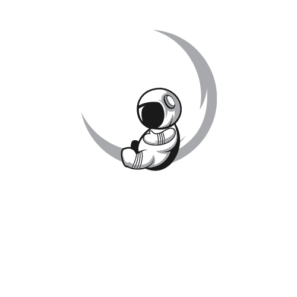

  
  
  
  
  
  
  
  
  
    
    

  <a name="readme-top"></a>
 <br />
 <div align="center">
 <h1 align="center">Nomad Nebula</h1>
    <a href="https://github.com/utgroup3/Nomad-Nebula">
     
   </a>
    <p align="center">
      Connect with the Cosmos
    </p>
  
<br />
<details><summary>Table of Contents;</summary>

* [About the Project](#description) 

* [Added Features](#features)
 
* [Installation](#installation)
 
* [Usage](#usage) 

* [Contributing](#contributing)
 
* [License](#license)

* [Questions](#questions)

</details>
</div>

<p align="right">(<a href="#readme-top">back to top</a>)</p>

<a name="description"></a>
## :rocket: About The Project
<p align="center">
  
</p>

Nomad Nebula is an interactive full-stack web application that serves as a stargazing companion and social platform for stargazers. Users can discover stars and planets visible in the night sky in their area, get daily updates on stargazing and visibility conditions, create and manage their profiles, view and interact with posts from other stargazers on the community page, and access detailed information about their zodiac signs.

<p align="right">(<a href="#readme-top">back to top</a>)</p>


<a name="features"></a>

## :star: Added Features

<p align="center">
  
</p>
- View stars and planets visible in the night sky based on user's location
- Stargazing and visibility conditions
- User profiles with profile pictures, liked posts, and published posts
- Community page showcasing posts from all users
- Zodiac information based on user's sign

<p align="right">(<a href="#readme-top">back to top</a>)</p>

<a name="installation"></a>

## :hammer_and_wrench: Installation

1. Clone the repository 

```bash
git clone https://github.com/utgroup3/Nomad-Nebula.git
```
2. Change the Working Directory

```bash
cd Nomad-Nebula
```
3. Install [`sequelize`](https://www.npmjs.com/package/inquirer), [`connect-session-sequelize`](https://www.npmjs.com/search?q=figlet), [`dotenv`](https://www.npmjs.com/package/dotenv), [`mysql2`](https://www.npmjs.com/package/mysql2), [`handlebars`](https://www.npmjs.com/package/handlebars), [`multer`](https://www.npmjs.com/package/handlebars), [`sharp`](https://www.npmjs.com/package/handlebars) and [`express`](https://www.npmjs.com/package/console.table)

```bash
npm i
```

4. Create a .env file in the root directory and add your MySQL username, password, and database name in the following format:

```bash
DB_NAME='your_database_name'
DB_USER='your_mysql_username'
DB_PW='your_mysql_password'
```
5. Create the tables in the database and seed them with test data

```bash
\Nomad-Nebula> npm run seed
```

6. Start the server

```bash
\Nomad-Nebula> npm start
```
5.  to *http://localhost:3001* in your browser to access the site
 


<p align="right">(<a href="#readme-top">back to top</a>)</p>

  <a name="usage"></a>

## :computer: Usage

<div align="center">
     
   </div>
   <br />
   <p align="center"> The deployed site can be found on
   <a href="https://drive.google.com/file/d/1oZJElx4QXzcGZlfQwMoUEVd9D6Ld_YKO/view?usp=sharing">Heroku</a>
   </p>

<p align="right">(<a href="#readme-top">back to top</a>)</p>
  

 <a name="contributing"></a>

## :handshake: Contributing


### Tasks and Roles 
[`Cassie LeClair`](https://github.com/cleclair71)
> Overall CSS design, animations, responsive design, designed MP4s in Canva, handlebars,  media, added bulma, incorporated Readme template front-end javascript, included multer and made updates
---
[`Jason Chiu`](https://github.com/jason1chiu)
> JavaScript Team Lead - backend javascript, debugging,  JavaScript alert, reviewing large conflicts, fixed multer integration errors, displayed map in night sky
--- 
[`Calvin Triu`](https://github.com/cntrieu)
> Javascript, horoscope handlebars, features and functions, debugging
---
[`Christina Barberi`](https://github.com/Christinaecb)
> Slideshow presentation, javascript, 
---
Kevin Tran
> 


<p align="right">(<a href="#readme-top">back to top</a>)</p>

<a name="license"></a>

## :clipboard: License
Distributed under the MIT License. See `LICENSE.txt` for more information.
  
<p align="right">(<a href="#readme-top">back to top</a>)</p>


<a name="questions"></a>

## :mailbox_with_no_mail: Questions?

If you have any questions about this project, please don't hesitate to reach out to me. I'm always happy to help and provide additional information.

### How to Ask a Question

1. **Check the existing documentation:** Before asking a question, please take a moment to review the existing documentation. Your question may already be answered in the README file or other project documentation.

2. **Create a new issue:** If you can't find the answer to your question in the documentation, please create a new issue in the project's issue tracker. Be sure to provide as much detail as possible about your question, including any relevant code snippets or screenshots.

   
### :pray: Feedback and Suggestions

We welcome feedback and suggestions for this project. If you have ideas for how to improve the project, please feel free to create a new issue or contact me directly. Your input is greatly appreciated!
 
  <p align="right">(<a href="#readme-top">back to top</a>)</p>
